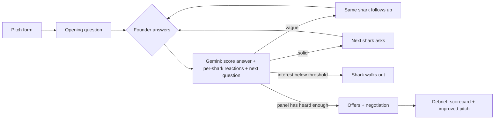

# Shark Tank Simulator

**Pitch your idea to AI investors who will not go easy on you.**

Everyone thinks their idea is brilliant, and nobody tells them the truth: real investors are hard to reach and friends are too polite. Shark Tank Simulator puts you in front of a panel of four AI investors. They grill you on *your* pitch round by round, dig into vague answers with follow-ups, walk out when you lose them, make offers you can negotiate, and send you home with a scorecard and a rewritten, stronger pitch.

**Live app (Google Cloud Run):** https://shark-tank-simulator-888217860739.asia-south1.run.app

**Try it in 3 minutes:** [`DEMO.md`](DEMO.md) has a tested walkthrough for a pitch that gets a deal and one that gets torn apart.

Built for PromptWars (8-hour Build With AI hackathon, Pondicherry University), problem statement **"Shark Tank Simulator"**.

---

## How it solves the problem statement
| Requirement | Where it lives | What you see |
|---|---|---|
| The user pitches an idea | `app/page.tsx`, `components/PitchForm.tsx`, `components/MicButton.tsx`, `lib/schemas.ts` (`pitchSchema`) | Idea, one-liner, ask (Rs lakh for %), pitch text, difficulty, sample pitches, voice dictation |
| An AI investor **panel** | `lib/sharks.ts`, `components/Stage.tsx`, `components/SharkFace.tsx`, `components/PanelList.tsx`, `components/SharkCard.tsx`, `components/InterestMeter.tsx` | Four illustrated investors on a stage, each with a distinct lens, personality and live interest meter (also in the sidebar) |
| The panel questions the founder, multi-turn | `app/api/turn/route.ts` → `lib/handlers.ts` (`runTurn`), `app/tank/page.tsx`, `components/Tank.tsx`, `components/AnswerBox.tsx`, `components/ChatLog.tsx` | Each shark speaks one line at a time, the founder answers, the next shark reacts and asks; the full transcript is one click away |
| **Hard** questions that dig into weak answers | `lib/prompts.ts` (`HARD_QUESTION_RULES`, scoring rubric), `lib/game.ts` (`pickNextAsker`, `followUpCandidate`) | Questions quote your own claims, demand numbers and names; a vague answer gets a **Follow-up** from the same shark and drops interest |
| The founder walks away with a **better pitch** | `app/api/debrief/route.ts` → `runDebrief`, `components/Debrief.tsx` | Scorecard per dimension, strengths and weaknesses, your toughest moment answered better, what each shark needed, a rewritten 60-second pitch (Copy / Pitch again), 3 fixes |
| Walkouts, offers and negotiation | `lib/game.ts`, `app/api/offers`, `app/api/negotiate`, `components/OfferCard.tsx`, `components/QuestionsDone.tsx` | Sharks walk out ("I'm out") with a reason; the rest make offers with implied valuation; counter, accept or walk; Explore with Sharks / Friendly / Realistic / Ruthless modes |
| Shark archetypes | `lib/sharks.ts` (`SHARK_ARCHETYPES`), `lib/schemas.ts`, `components/PitchForm.tsx`, `components/Stage.tsx` | 3 distinct archetypes per shark (Growth Hacker, Value Investor, Systems Architect, etc.) with safe server-side enum resolution |
| Illustrated, reactive sharks | `components/SharkFace.tsx`, `components/FaceEmote.tsx`, `components/emotes.ts` | Vector portraits with moods that follow interest; an emote pops up as each shark reacts to your answer |
| Stage and verdict visuals | `components/Stage.tsx`, `components/Debrief.tsx`, `components/OfferCard.tsx`, `components/verdict.ts` | Lit tank set with a speech bubble pointing at the speaker, question progress bar, each offer compared with your valuation ("20% below your valuation"), a score ring with a verdict band |
| Stage presence | `components/greeting.ts`, `components/useScript.ts`, `components/mumble.ts` | The panel greets you by idea and ask; lines type out with per-shark "mumble" sound blips (toggle in the header) |
| Light and dark themes | `components/ThemeToggle.tsx`, `components/Shell.tsx`, `app/globals.css` | Theme toggle in the header, app shell with breadcrumbs and panel sidebar |
| Demo replay (no network) | `components/DemoReplay.tsx`, `lib/demoScript.ts` | Two recorded real sessions (a strong and a weak pitch) that play back with zero API calls |
| Guided walkthroughs | [`DEMO.md`](DEMO.md) | Tested scripts for a pitch that gets a deal and one that gets torn apart |

### "Make it yours": our answers
- **Who sits on the panel?** Four investors who together cover a real investment memo:
  - **Vikram Rao, The Numbers** (ex-banker): unit economics, margins, valuation.
  - **Meera Iyer, The Customer** (D2C founder): who pays, demand evidence, distribution.
  - **Arjun Mehta, The Skeptic** (deep-tech CTO): moat, feasibility, copycat risk.
  - **Zara Khan, The Visionary** (brand investor): founder fit, conviction, market size.
- **What makes a question hard?** It quotes a specific claim back at you, asks for something checkable (a number, a named customer, a date), targets the weakest point in that investor's lens, catches contradictions with earlier answers, and never lets a dodge slide: the same shark follows up (at most twice in a row) and names exactly what was missing.
- **What helps the founder walk away better?** Interest meters show in real time which answers landed. The debrief scores each dimension, rewrites your weakest answer, explains what each shark wanted to hear, and rewrites your pitch using your real facts. Where you had no data, it leaves `[your number]` placeholders instead of inventing traction. **Pitch again** pre-fills the improved pitch so you can try again and compare.

## How a session works

- **One Gemini call per turn** both scores the answer and writes the next question.
- The game rules are deterministic code in `lib/game.ts`: interest clamping, difficulty multipliers, walkout thresholds, who asks next, offer eligibility and valuation maths. The model writes the words; the code enforces the rules.
- The server is stateless. The session lives in the browser, and the client sends the slice each request needs.

## Google services used
| Service | How we use it | Where |
|---|---|---|
| **Gemini on Vertex AI** (`@google/genai`; `gemini-3.5-flash-lite` → `gemini-3.5-flash`) | Questions, answer scoring, shark reactions, offers, negotiation and the debrief, all via **structured JSON output** (`responseMimeType: "application/json"` plus a `responseJsonSchema` generated from the same Zod schemas that validate the reply). In production Cloud Run calls Vertex AI with its own service account (IAM role `aiplatform.user`), so no API key is needed | `lib/gemini.ts`, `lib/prompts.ts`, `lib/handlers.ts` |
| **Google Cloud Run** | Hosts the app (asia-south1) as a non-root container; scales to zero | `Dockerfile`, live URL above |
| **Cloud Build + Artifact Registry** | Build the container from source on every deploy | `gcloud run deploy --source .` |
| **Secret Manager** | Stores the optional `GEMINI_API_KEY` (Gemini Developer API mode), mounted into Cloud Run at runtime; the key never touches the repo, image or browser | Deploy command below |
| **Cloud IAM** | Least-privilege service account for Vertex AI calls | `roles/aiplatform.user` on the Cloud Run service account |
| **Cloud Logging** | One structured JSON line per request with a `severity` field (INFO / WARNING / ERROR) that Cloud Logging indexes, plus route, latency, model and AI vs. fallback. We used it to find and fix quota and timeout fallbacks during the build. Pitch text is never logged | `lib/log.ts`, `lib/http.ts` |
| **Google Fonts** | Typefaces via `next/font/google`, self-hosted at build time | `app/layout.tsx` |

## Quality
### Testing
```bash
npm test               # Vitest: game rules, validation, prompts, fallbacks, Gemini client, every API route, key UI components
npm run test:coverage  # coverage report
```
- **Gemini is mocked in the unit and route tests.** They cover:
  - the success path, invalid JSON, a reply that breaks the schema and the model fallback chain;
  - a 503/429 falling back to scripted content;
  - rate limiting, oversized bodies and invalid input.
- **UI tests** (jsdom + Testing Library): the offer card (counter form validation, keyboard-reachable actions, disabled while waiting), debrief regions, the stage's screen-reader line, the transcript log, the typewriter script hook, the API client's error handling and the panel's reaction order.
- **Coverage** (Vitest v8): **`lib/` 96% of lines, API routes 100%, UI components 66%, 79% overall**. CI fails if `lib/` drops below 90%, the API routes below 95% or UI components below 60%.
- GitHub Actions (`.github/workflows/ci.yml`) runs lint, typecheck and tests with coverage on every push.

### Security
- **No API key in production:** Cloud Run calls Vertex AI with its own service account (least-privilege `roles/aiplatform.user`). The optional Developer API key lives in Secret Manager, and Gemini code is server-only (`server-only` guard).
- Every request body is validated with Zod: types, ranges, length caps, a 32 KB body limit. Gemini replies are validated against the same schemas, then clamped in code before use.
- **Prompt-injection defence:**
  - Founder text is wrapped in data tags.
  - Angle brackets are neutralised, so the text cannot close a tag.
  - The system prompt says tagged content is data, not instructions.
- Per-IP rate limit (30 requests a minute), keyed on the address Cloud Run appends to `X-Forwarded-For`, so a client cannot dodge it by sending a fake one. Generic error messages.
- Security headers: CSP, `frame-ancestors 'none'`, `nosniff`, `Referrer-Policy`, `Permissions-Policy`, HSTS.
- The container runs as non-root. No `dangerouslySetInnerHTML`.
- **Accepted trade-off:** the session lives in the browser, so a user could edit their own scores. That only affects their own game; nothing is stored or shared server-side.

### Reliability and efficiency
- **Fallback chain:** Gemini models are tried in order (13 s per attempt, 26 s in total; the debrief gets 14 s per attempt and 35 s in total). A model that returns 429 or 503 is skipped briefly (20 s on Vertex AI). After that come deterministic scripted questions, scoring, offers and debrief (`lib/fallback.ts`). A session never dead-ends, and the API never returns a 5xx for an AI failure. Measured live: about 3 s per turn, about 4 s per debrief.
- **Fast turns:** each turn is one call with a low thinking level and only the last 10 exchanges in the prompt.
- **Lean dependencies:** Next.js, React, `@google/genai`, Zod. No UI kit, chart library or database.

### Accessibility
Semantic landmarks and headings, labelled form fields with linked error messages, `role="meter"` interest meters with text values, shark lines announced through `aria-live` regions (the typewriter text itself is hidden from screen readers), a `role="log"` transcript, full keyboard flow with visible focus, WCAG AA contrast in both themes, and support for `prefers-reduced-motion`. Voice dictation and sounds are progressive enhancements. Lighthouse accessibility score: 100.

## Run locally
```bash
npm install
cp .env.example .env.local   # add GEMINI_API_KEY (free at https://aistudio.google.com/apikey)
npm run dev                  # http://localhost:3000
npm test
```

## Deploy (Google Cloud Run + Vertex AI)
Production calls Gemini through **Vertex AI** with the Cloud Run service account, so no API key is needed:
```bash
gcloud services enable run.googleapis.com aiplatform.googleapis.com
gcloud projects add-iam-policy-binding PROJECT_ID   --member serviceAccount:PROJECT_NUMBER-compute@developer.gserviceaccount.com --role roles/aiplatform.user
gcloud run deploy shark-tank-simulator --source . --region asia-south1 --env-vars-file env.yaml
```
`env.yaml` (no secrets):
```yaml
GEMINI_USE_VERTEX: "true"
GOOGLE_CLOUD_PROJECT: "PROJECT_ID"
GOOGLE_CLOUD_LOCATION: "global"
GEMINI_MODELS: "gemini-3.5-flash-lite,gemini-3.5-flash"
```
To use the Gemini Developer API instead, store the key in Secret Manager (`gcloud secrets create gemini-api-key --data-file=key.txt`), drop `GEMINI_USE_VERTEX`, and add `--update-secrets GEMINI_API_KEY=gemini-api-key:latest`.

## Project layout
```
app/            pages (/, /tank) and API routes (/api/turn, /api/offers, /api/negotiate, /api/debrief)
components/     UI: app shell, pitch form, stage and shark faces, interest meters, transcript, offers, debrief, demo replay
lib/            schemas, game rules, sharks, prompts, Gemini client, fallbacks, rate limit, logging
tests/          Vitest unit, route and component tests
```

**Stack:** Next.js 16, React 19, TypeScript, Tailwind CSS 4, Zod, Gemini API, Google Cloud Run.
