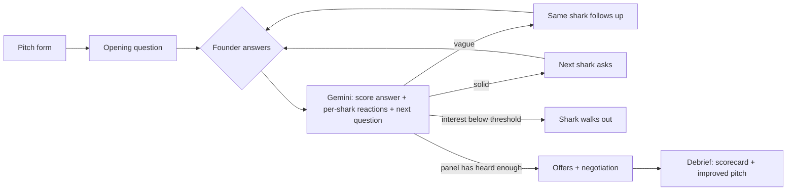

# Shark Tank Simulator

**Pitch your idea to AI investors who will not go easy on you.**

Everyone thinks their idea is brilliant, and nobody tells them the truth: real investors are hard to reach and friends are too polite. Shark Tank Simulator puts you in front of a panel of four AI investors. They grill you on *your* pitch round by round, dig into vague answers with follow-ups, walk out when you lose them, make offers you can negotiate, and send you home with a scorecard and a rewritten, stronger pitch.

**Live app (Google Cloud Run):** https://shark-tank-simulator-888217860739.asia-south1.run.app

Built for PromptWars (8-hour Build With AI hackathon, Pondicherry University), problem statement **"Shark Tank Simulator"**.

---

## How it solves the problem statement
| Requirement | Where it lives | What you see |
|---|---|---|
| The user pitches an idea | `app/page.tsx`, `components/PitchForm.tsx`, `lib/schemas.ts` (`pitchSchema`) | Idea, one-liner, ask (Rs lakh for %), pitch text, difficulty, sample pitches, voice input |
| An AI investor **panel** | `lib/sharks.ts`, `components/SharkPanel.tsx` | Four investors, each with a distinct lens, personality and live interest meter |
| The panel questions the founder, multi-turn | `app/api/turn/route.ts` → `lib/handlers.ts` (`runTurn`), `app/tank/page.tsx` | One question at a time, the founder answers, the next shark reacts and asks |
| **Hard** questions that dig into weak answers | `lib/prompts.ts` (`HARD_QUESTION_RULES`, scoring rubric), `lib/game.ts` (`pickNextAsker`, `followUpCandidate`) | Questions quote your own claims, demand numbers and names; a vague answer gets a **Follow-up** from the same shark and drops interest |
| The founder walks away with a **better pitch** | `app/api/debrief/route.ts` → `runDebrief`, `components/Debrief.tsx` | Scorecard per dimension, strengths and weaknesses, your toughest moment answered better, what each shark needed, a rewritten 60-second pitch (Copy / Pitch again), 3 fixes |
| Extras | `lib/game.ts`, `app/api/offers`, `app/api/negotiate` | Walkouts ("I'm out"), offers with implied valuation, counter-offers, Friendly / Realistic / Ruthless modes |

### "Make it yours": our answers
- **Who sits on the panel?** Four investors who together cover a real investment memo:
  - **Vikram Rao, The Numbers** (ex-banker): unit economics, margins, valuation.
  - **Meera Iyer, The Customer** (D2C founder): who pays, demand evidence, distribution.
  - **Arjun Mehta, The Skeptic** (deep-tech CTO): moat, feasibility, copycat risk.
  - **Zara Khan, The Visionary** (brand investor): founder fit, conviction, market size.
- **What makes a question hard?** It quotes a specific claim back at you, asks for something checkable (a number, a named customer, a date), targets the weakest point in that investor's lens, catches contradictions with earlier answers, and never lets a dodge slide: the same shark follows up (at most twice in a row) and names exactly what was missing.
- **What helps the founder walk away better?** Interest meters show in real time which answers landed. The debrief scores each dimension, rewrites your weakest answer, explains what each shark wanted to hear, and rewrites your pitch using your real facts. Where you had no data, it leaves `[your number]` placeholders instead of inventing traction. **Pitch again** pre-fills the improved pitch so you can try again and compare.

## How a session works

- **One Gemini call per turn** both scores the answer and writes the next question.
- The game rules are deterministic code in `lib/game.ts`: interest clamping, difficulty multipliers, walkout thresholds, who asks next, offer eligibility and valuation maths. The model writes the words; the code enforces the rules.
- The server is stateless. The session lives in the browser, and the client sends the slice each request needs.

## Google services used
| Service | How we use it | Where |
|---|---|---|
| **Gemini API** (`@google/genai`; `gemini-3.5-flash`, fallback `gemini-3.5-flash-lite`) | Questions, answer scoring, shark reactions, offers, negotiation and the debrief, all via **structured JSON output** (`responseJsonSchema` generated from our Zod schemas) | `lib/gemini.ts`, `lib/prompts.ts`, `lib/handlers.ts` |
| **Google Cloud Run** | Hosts the app (asia-south1) as a non-root container; scales to zero | `Dockerfile`, live URL above |
| **Cloud Build + Artifact Registry** | Build the container from source on every deploy | `gcloud run deploy --source .` |
| **Secret Manager** | Stores `GEMINI_API_KEY`, mounted into Cloud Run at runtime; the key never touches the repo, image or browser | Deploy command below |
| **Cloud Logging** | Structured JSON request logs (route, latency, model, AI vs. fallback); pitch text is never logged | `lib/log.ts`, `lib/http.ts` |
| **Google Fonts** | Typefaces via `next/font/google`, self-hosted at build time | `app/layout.tsx` |

## Quality
### Testing
```bash
npm test               # Vitest: game rules, validation, prompts, fallbacks, Gemini client, every API route
npm run test:coverage  # coverage report
```
- **Gemini is mocked in the unit and route tests.** They cover:
  - the success path, invalid JSON, a reply that breaks the schema and the model fallback chain;
  - a 503/429 falling back to scripted content;
  - rate limiting, oversized bodies and invalid input.
- GitHub Actions (`.github/workflows/ci.yml`) runs lint, typecheck and tests on every push.

### Security
- The Gemini key lives in Secret Manager and is only read server-side (`server-only` guard).
- Every request body is validated with Zod: types, ranges, length caps, a 32 KB body limit. Gemini replies are validated against the same schemas, then clamped in code before use.
- **Prompt-injection defence:**
  - Founder text is wrapped in data tags.
  - Angle brackets are neutralised, so the text cannot close a tag.
  - The system prompt says tagged content is data, not instructions.
- Per-IP rate limit (30 requests a minute). Generic error messages.
- Security headers: CSP, `frame-ancestors 'none'`, `nosniff`, `Referrer-Policy`, `Permissions-Policy`, HSTS.
- The container runs as non-root. No `dangerouslySetInnerHTML`.
- **Accepted trade-off:** the session lives in the browser, so a user could edit their own scores. That only affects their own game; nothing is stored or shared server-side.

### Reliability and efficiency
- **Fallback chain:** primary model → lighter model → deterministic scripted questions, scoring, offers and debrief (`lib/fallback.ts`). A session never dead-ends, and the API never returns a 5xx for an AI failure.
- **Fast turns:** each turn is one call with a low thinking level, a 12 s timeout and only the last 10 exchanges in the prompt (about 3 s per turn).
- **Lean dependencies:** Next.js, React, `@google/genai`, Zod. No UI kit, chart library or database.

### Accessibility
Semantic landmarks and headings, labelled form fields with linked error messages, `role="meter"` interest meters with text values, an `aria-live` chat log, full keyboard flow with visible focus, WCAG AA contrast, and support for `prefers-reduced-motion`. Voice input is a progressive enhancement.

## Run locally
```bash
npm install
cp .env.example .env.local   # add GEMINI_API_KEY (free at https://aistudio.google.com/apikey)
npm run dev                  # http://localhost:3000
npm test
```

## Deploy (Google Cloud Run)
```bash
gcloud secrets create gemini-api-key --data-file=key.txt
gcloud run deploy shark-tank-simulator --source . --region asia-south1 \
  --update-secrets GEMINI_API_KEY=gemini-api-key:latest \
  --update-env-vars GEMINI_MODEL=gemini-3.5-flash,GEMINI_FALLBACK_MODEL=gemini-3.5-flash-lite
```

## Project layout
```
app/            pages (/, /tank) and API routes (/api/turn, /api/offers, /api/negotiate, /api/debrief)
components/     UI: pitch form, shark panel, interest meters, chat, offers, debrief
lib/            schemas, game rules, sharks, prompts, Gemini client, fallbacks, rate limit, logging
tests/          Vitest unit and route tests
```

**Stack:** Next.js 16, React 19, TypeScript, Tailwind CSS 4, Zod, Gemini API, Google Cloud Run.
